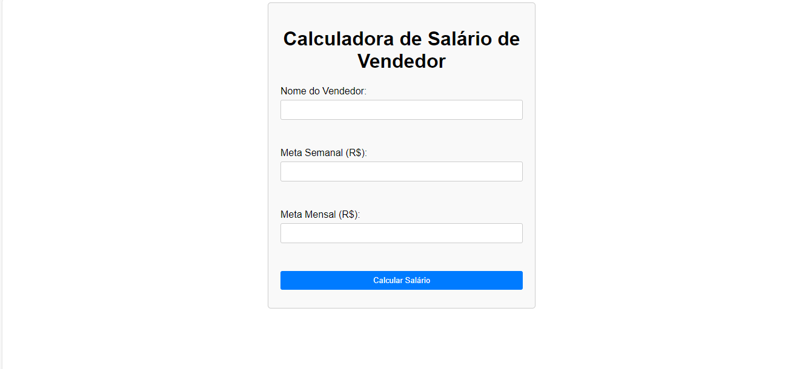

# Calculadora de Salário de Vendedor

Este é um sistema simples desenvolvido em PHP para calcular o salário de vendedores com base em metas de vendas semanais e mensais, conforme especificado em um cenário de empresa descrito.

## Funcionalidades

- Solicita o nome do vendedor.
- Solicita os valores de meta semanal e mensal.
- Calcula o salário final do vendedor com base nas metas e nos critérios de bonificação definidos pela empresa.
- Exibe o resultado do cálculo para o usuário.

## Como Usar

1. Abra o arquivo `index.php` em um navegador da web.

2. Preencha o formulário com o nome do vendedor, a meta semanal e a meta mensal.

3. Pressione o botão "Calcular Salário".

4. O sistema calculará o salário final do vendedor com base nas informações fornecidas e exibirá o resultado.

## Licença

Este projeto está licenciado sob a Licença MIT. Consulte o arquivo [LICENSE](LICENSE) para obter mais detalhes.

